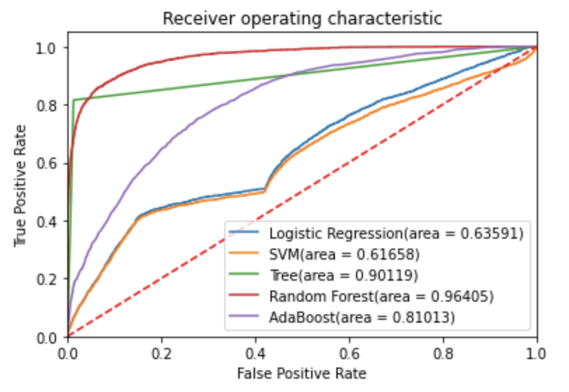
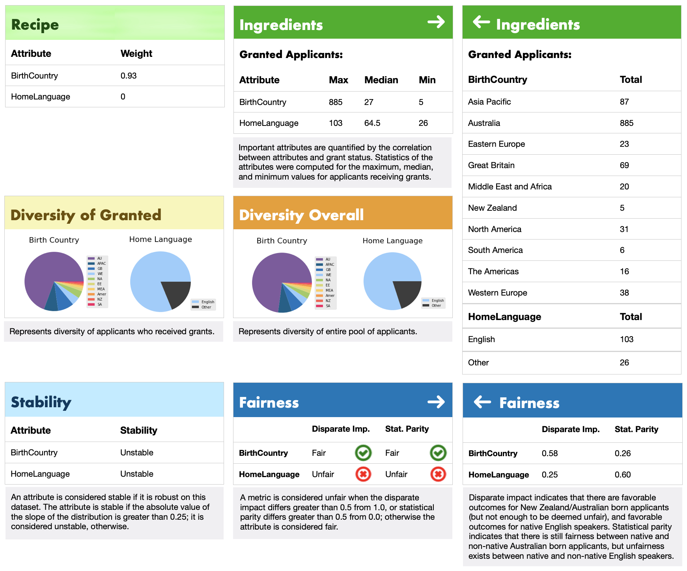
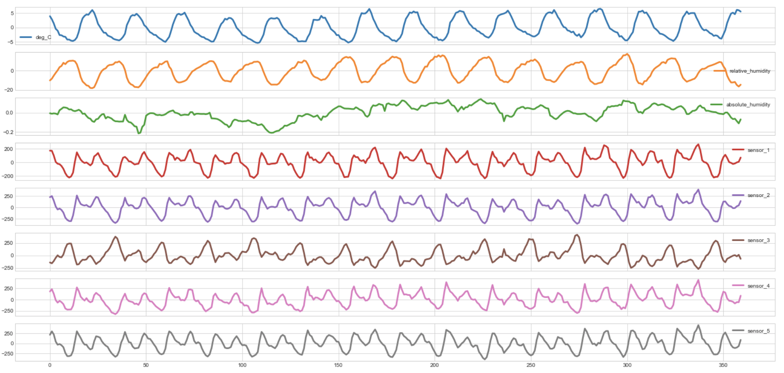

# Data Science Portfolio

## <a href="https://github.com/MichaelPoma/gta_online_hacker_detection" target="_blank"><b>Project 1:</b> Hacker Detection NYU 2022 Rockstar Games Datathon</a>
- Identified 500+ plausible hackers in GTA Online player base for Rockstar developers
- Drew insights from player activity and personal domain knowledge of the game
- Deemed hacker if exceeded upper bound of predicted character rank for a given session
- Built 5 models with ensembling AdaBoost classifier as best for scalability with AUC of 0.81
- Selected by professor to showcase project in machine learning lecture to 150+ students

## <a href="https://github.com/MichaelPoma/ds_melbourne_grant_predictions_proj" target="_blank"><b>Project 2:</b> University Grant Predictions Interpretability Tool</a>
- Built a visual interpretability tool for a university grant prediction model developed in a Kaggle competition **(Nutritional Label)**
- Engineered missing data and one-hot encoded categorial values
- Investigated attribute weights and disparities within Birth Country and Home Language features (Recipe & Diversity)
- Generated a statistical description across 12 different subpopulations (Ingredients)
- Determined the robustness of the prediction methodology on data (Stability)
- Measured the group fairness through disparate impact and statistical parity (Fairness)

## <a href="https://github.com/MichaelPoma/ds_air_pollution_predictions_proj" target="_blank"><b>Project 3:</b> Data Science Air Pollution Predictions</a>
- Created models to help meteorologists estimate air pollution measurements (RMSLE ~ 0.233)
- Trained over 7000 entries of weather information and sensor data measurements
- Performed time series decomposition to visualize seasonality, trend, and residual patterns in data
- Engineered lag features based on autocorrelation and partial autocorrelation patterns
- Optimized CatBoostRegressors to reach the best hyperparameter tuned models
- Placed in top 27% of *Kaggle Tabular Playground Series - Jul 2021* competition

## <a href="https://github.com/MichaelPoma/ds_20newsgroups_shap_explanations_proj" target="_blank"><b>Project 4:</b> Data Science SHAP Explanations</a>
- Created a classifier to classify documents based on religious sentiment (accuracy ~ 91%)
- Preprocessed data using a TfidfVectorizer to transform text to feature vectors and filter out uncommon words
- Identified words that contributed to misclassification of documents and in which documents
- Generated visual explanations of feature values using SHAP
- Optimized SGDClassifier using chi-square filter feature selection to improve accuracy

